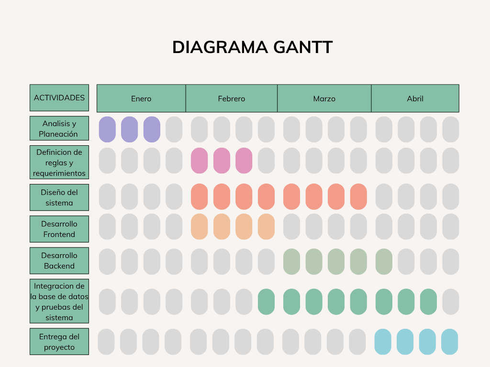
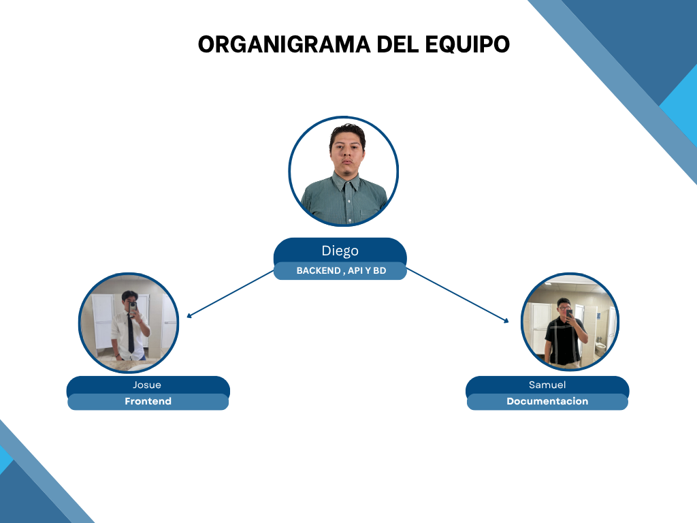

<table width="100% border="0">
<tr>
<td width="50%" align="center"> </td>
<td width="50%" align="center"> </td>
</table>

---
# Proyecto-TimeFocus
### TIMEFOCUS - PRODUCTIVIDAD ACADEMICA

TimeFocus es una aplicación móvil desarrollada para mejorar la productividad académica de estudiantes universitarios mediante herramientas como la gestión de tareas, la técnica Pomodoro y un sistema de autenticación segura. Su diseño busca fomentar la organización, la disciplina y el aprovechamiento eficiente del tiempo de estudio.

### DESCRIPCION

TimeFocus es una aplicación móvil enfocada en estudiantes universitarios que permite gestionar tareas académicas, organizar actividades y mejorar hábitos de estudio mediante la técnica Pomodoro. Además, integra funcionalidades offline y visualización de estadísticas para ofrecer una experiencia completa y eficiente.

---

### PLANTEAMIENTO DEL PROBLEMA

Muchos estudiantes universitarios presentan dificultades para organizar su tiempo y gestionar sus actividades académicas, lo que impacta negativamente en su rendimiento. La falta de herramientas centralizadas que combinen gestión de tareas, técnicas de concentración y seguimiento del progreso limita la productividad. Además, el uso de múltiples aplicaciones dispersas dificulta la continuidad del trabajo, especialmente en entornos con conectividad limitada.

---

### PROPUESTA DE SOLUCION

Se propone el desarrollo de TimeFocus como una solución integral que permita a los estudiantes gestionar sus tareas, aplicar técnicas de estudio como Pomodoro y visualizar su progreso académico. La aplicación busca centralizar funciones clave en una sola plataforma, facilitando la organización y mejorando la productividad.

---

### OBJETIVO GENERAL

Desarrollar una aplicación móvil que permita a los estudiantes mejorar su productividad académica mediante la gestión eficiente de tareas, el uso de técnicas de concentración y el seguimiento de su desempeño.

---

### OBJETIVOS ESPECIFICOS

<strong>Gestión de tareas</strong>: Permitir la creación, edición, eliminación y seguimiento de tareas académicas.

<strong>Implementación de Pomodoro</strong>: Integrar un temporizador configurable que facilite la concentración y el manejo del tiempo.

<strong>Modo offline</strong>: Permitir el uso de la aplicación sin conexión a internet mediante almacenamiento local.

<strong>Visualización de estadísticas</strong>: Mostrar el progreso del usuario a través de un dashboard.

<strong>Autenticación segura</strong>: Garantizar el acceso mediante login tradicional y Google Sign-In.

---

### DIAGRAMA DE GANNT

---

### TABLA DE COLABORADORES

| Nombre                      | Usuario | Puesto |
|-----------------------------|--------|--------|
| Diego Garrido Castillo      | [Diego Garrido](https://github.com/Wolflooop)   | Backend , api y bd |
| Josué Olearte Hernández     | [Josué Olarte](https://github.com/Josu03-MC)   | Frontend |
| Samuel Ramírez Martínez     |[Samuel Martinez](https://github.com/240483-cell)   | Documentacion |

---

### ORGANIGRAMA DEL EQUIPO

---

### LISTA DE TECNOLOGIAS

*Cliente:*

*Arquitectura:*

*Backend / Consumo API:*

*Persistencia:*

*Herramientas:*

*Pruebas:*

*Documentación:*

